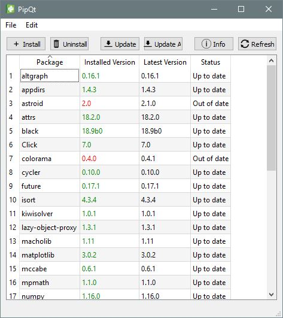

# PipQt

A basic GUI client for Python's `pip`.

## Requirements
- Python 3.6+
- PySide2
- `pip` installed and in PATH

## OS Compatibility
Only tested on Windows, but all the code should be OS-independent.
